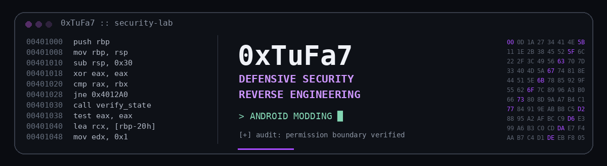

  

  

<code>Defensive Security</code> ·
<code>Reverse Engineering</code> ·
<code>Android Analysis</code> ·
<code>Security Tooling</code>

---

"> whoami"

class TuFa7:
    focus = [
        "Defensive Cybersecurity",
        "Reverse Engineering",
        "Android Analysis",
        "Security Tooling",
        "Automation"
    ]

    workflow = "inspect -> trace -> patch -> test -> harden"

I build, analyze, and debug software with a focus on defensive cybersecurity, reverse engineering, Android applications, automation, and system tooling.

---

"// github"

 

---

"// projects"

🐈 KittyGram

Enhanced Android Instagram project focused on reverse engineering, runtime hooks, UI injection, privacy features, media utilities, debugging, and compatibility across Instagram updates.

"Android" "Reverse Engineering" "Hooks" "UI Injection" "Debugging"

""Repository" (https://img.shields.io/badge/OPEN_REPOSITORY-6A00FF?style=for-the-badge&logo=github&logoColor=white)" (https://github.com/XTUFA7/KittyGram)

---

⚡ LiteBar

Lightweight Windows tray utility for system cleanup, Explorer recovery, power controls, shortcuts, and quick workflow actions.

"Windows" "System Utilities" "Automation"

""Repository" (https://img.shields.io/badge/OPEN_REPOSITORY-6A00FF?style=for-the-badge&logo=github&logoColor=white)" (https://github.com/XTUFA7/LiteBar)

---

⌨️ LayFix

Windows utility for fixing text typed using the wrong Arabic / English keyboard layout.

"Windows" "Productivity" "Automation"

""Repository" (https://img.shields.io/badge/OPEN_REPOSITORY-6A00FF?style=for-the-badge&logo=github&logoColor=white)" (https://github.com/XTUFA7/LayFix)

---

🧅 Onion Domain Generator

Tool and guide for generating ".onion" domains with Tor Hidden Services while following privacy, isolation, and operational-security practices.

"Tor" "Privacy" "Security"

""Repository" (https://img.shields.io/badge/OPEN_REPOSITORY-6A00FF?style=for-the-badge&logo=github&logoColor=white)" (https://github.com/XTUFA7/onion-domain-generator)

---

👁️ GodEye

Private defensive-security R&D focused on system monitoring, activity visibility, detection workflows, behavioral analysis, and security research.

"Private R&D" "Monitoring" "Detection" "Security Research"

---

"// stack"

  

---

"// security"

Defensive Security
Reverse Engineering
Android Application Analysis
Runtime & Hook Debugging
Static / Dynamic Analysis
Security Monitoring
Automation
System Tooling

---

"> workflow"

inspect -> understand -> trace -> patch -> test -> harden

---

"// activity"

  

  

DEFEND • REVERSE • BUILD • HARDEN

