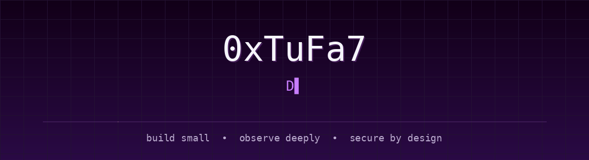

<div align="center">



<br>


<br>

<a href="https://github.com/XTUFA7">
  
</a>
<a href="https://x.com/0xtufa7">
  
</a>
<a href="https://instagram.com/_BB5BB">
  
</a>

</div>

---

## `> whoami`

Defensive security builder focused on **behavioral analysis, monitoring workflows, local-first utilities, and lightweight system tooling**.

I build practical tools for **Windows and Linux**, with an emphasis on clean interfaces, low overhead, visibility, automation, and security-first engineering.

```text
Focus     → Defensive Security / Monitoring / Behavioral Analysis
Approach  → Local-First / Lightweight / Practical
Systems   → Windows / Linux
Mindset   → Build small. Observe deeply. Secure by design.
```

---

## `> selected_projects`

<table>
<tr>
<td width="50%" valign="top">

### ⚡ LiteBar

Lightweight Windows tray utility for cleanup, Explorer recovery, power-mode switching, and fast system controls.

**Stack:** Windows · System Utilities · Automation

[](https://github.com/XTUFA7/LiteBar)

</td>
<td width="50%" valign="top">

### 👁️ GodEye

Private behavioral monitoring and analysis system built around visibility, detection workflows, lightweight dashboards, and local-first analysis.

**Focus:** Monitoring · Detection · Analysis


</td>
</tr>

<tr>
<td width="50%" valign="top">

### ⌨️ LayFix

Tray-first Arabic / English keyboard layout fixer. Select text, trigger a shortcut, and replace only the selected content locally.

**Focus:** Productivity · Local Processing

[](https://github.com/XTUFA7/LayFix)

</td>
<td width="50%" valign="top">

### 🧅 Onion Domain Generator

Beginner-friendly guide for generating `.onion` domains with Tor Hidden Services, including isolation and operational-safety notes.

**Focus:** Tor · Privacy · Operational Safety

[](https://github.com/XTUFA7/onion-domain-generator)

</td>
</tr>
</table>

---

## `> stack`

<div align="center">

### Languages


<br><br>

### Systems & Tools


</div>

---

<details>
<summary><b>🛡️ Current Focus</b></summary>

<br>

- Defensive security tooling
- Behavioral monitoring concepts
- Detection workflows
- Lightweight Windows utilities
- Local-first system design
- Clean technical interfaces

</details>

<details>
<summary><b>⚙️ Engineering Principles</b></summary>

<br>

- Keep tools lightweight and understandable.
- Prefer local processing when remote infrastructure is unnecessary.
- Treat visibility and logging as first-class features.
- Design security into the workflow instead of adding it later.
- Build interfaces that expose useful information without unnecessary complexity.

</details>

---

<div align="center">


<br><br>


<br><br>

<sub>build small • observe deeply • secure by design</sub>

</div>
