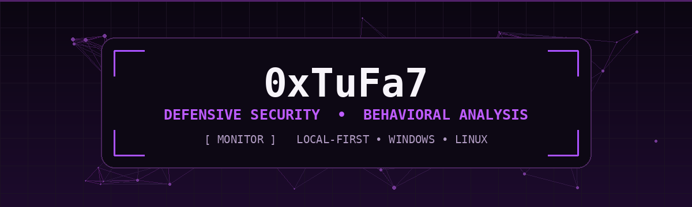
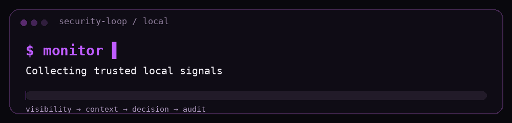

<div align="center">



<br>

### Security · Android · Systems Builder

**Defensive Security** · **Behavioral Analysis** · **Android Development** · **Local-First Tools** · **Windows & Linux**

<br>

<a href="https://github.com/xtufa7">
  
</a>
<a href="https://x.com/0xtufa7">
  
</a>
<a href="https://instagram.com/_BB5BB">
  
</a>
<a href="https://t.me/xKittygram">
  
</a>

</div>

<br>

<table>
<tr>
<td width="52%" valign="top">

## `> whoami`

I build **security-focused software, Android projects, and lightweight system utilities** around visibility, privacy, automation, and practical workflows.

My work spans **Android, Windows, and Linux**, with a strong preference for **clean interfaces, low overhead, local-first design, and secure-by-design engineering**.

</td>
<td width="48%" valign="top">

## `> current_focus`

```yaml
security:
  - behavioral monitoring
  - threat detection
  - defensive tooling

development:
  - Android
  - Windows utilities
  - Linux automation

principles:
  - local-first
  - lightweight
  - secure-by-design
```

</td>
</tr>
</table>

---

<div align="center">

# 🐈 KittyGram

### `FEATURED PROJECT`

**A cleaner, more capable Instagram experience for Android.**


<br><br>

KittyGram is my Android project focused on extending the Instagram experience with a custom interface, privacy-oriented controls, media and workflow enhancements, and deeper app-level customization.

Built with an emphasis on **stability, clean integration, privacy, and a native-feeling user experience**.

<br>

[](https://github.com/xtufa7/KittyGram)
[](https://t.me/xKittygram)

</div>

---

<div align="center">

## `// what_i_build`

</div>

<table>
<tr>
<td width="25%" align="center" valign="top">

### 🛡️ Defend
Security-oriented tooling, controls, and detection workflows.

</td>
<td width="25%" align="center" valign="top">

### 📱 Build
Android projects and app-level interface and workflow customization.

</td>
<td width="25%" align="center" valign="top">

### 👁️ Observe
Behavioral monitoring with useful context instead of raw noise.

</td>
<td width="25%" align="center" valign="top">

### ⚡ Optimize
Small system utilities built for speed, low overhead, and practical use.

</td>
</tr>
</table>

<br>

<div align="center">

</div>

---

<div align="center">

## `// pinned_projects`

</div>

<table>
<tr>
<td width="50%" valign="top">

### ⚡ LiteBar

A lightweight Windows tray utility for **quick cleanup, Explorer recovery, power mode switching, shortcuts, and compact workflow controls**.

`Windows` `System Utilities` `Automation` `Lightweight`

<br>

[](https://github.com/xtufa7/LiteBar)

</td>

<td width="50%" valign="top">

### ⌨️ LayFix

Fix mixed Arabic and English keyboard-layout mistakes instantly from selected text while keeping the workflow **local and lightweight**.

`Windows` `Productivity` `Local Processing`

<br>

[](https://github.com/xtufa7/LayFix)

</td>
</tr>

<tr>
<td width="50%" valign="top">

### 🧅 Onion Domain Generator

A beginner-friendly guide for generating `.onion` domains using Tor Hidden Services with **security best practices and isolation guidance**.

`Tor` `Privacy` `Operational Safety`

<br>

[](https://github.com/xtufa7/onion-domain-generator)

</td>

<td width="50%" valign="top">

### 👁️ GodEye

Private monitoring and behavioral-analysis R&D focused on **activity visibility, lightweight dashboards, detection workflows, and local-first monitoring concepts**.

`Private R&D` `Monitoring` `Behavioral Analysis` `Detection`

<br>


</td>
</tr>
</table>

---

<div align="center">

## `// toolkit`

### Languages & Scripting


<br><br>

### Platforms, Systems & Infrastructure


</div>

---

<table>
<tr>
<td width="50%" valign="top">

## `> engineering_principles`

- **Secure by design** — security belongs in the architecture.
- **Privacy-aware** — minimize unnecessary data exposure.
- **Low overhead** — useful software should not fight the system it runs on.
- **Observable** — important actions should be understandable and auditable.
- **Practical** — build around real workflows, not feature count.

</td>
<td width="50%" valign="top">

## `> areas_of_interest`

- Defensive security engineering
- Android application development
- Behavioral and activity analysis
- Detection and monitoring workflows
- Windows system utilities
- Linux tooling and automation
- Privacy-focused product design

</td>
</tr>
</table>

---

<div align="center">

## `// github_activity`


<br><br>


</div>

---

<div align="center">

### `build → observe → analyze → harden`

<sub>Build small. Observe deeply. Secure by design.</sub>

<br><br>


</div>
