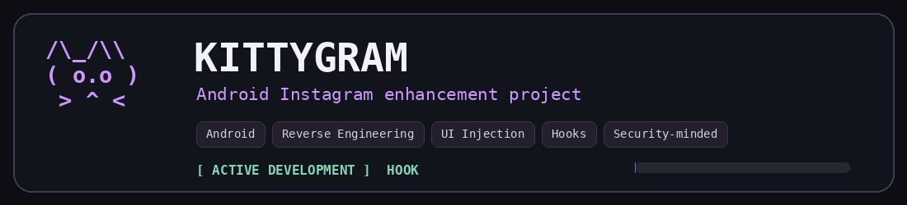

<div align="center">


<br><br>

<a href="https://github.com/XTUFA7">
  
</a>
<a href="https://x.com/0xtufa7">
  
</a>
<a href="https://instagram.com/_BB5BB">
  
</a>

</div>

---

# 🐈 KittyGram — Featured Project

<div align="center">
<a href="https://github.com/XTUFA7/KittyGram">

</a>
</div>

**KittyGram** is my main active Android project: an enhanced Instagram experience built around **reverse engineering, runtime/UI hooks, feature injection, media utilities, privacy controls, and careful compatibility work across Instagram updates**.

The project involves tracing changing app internals, rebuilding broken injection points, stabilizing hooks, and designing features that behave naturally inside the original app instead of feeling bolted on.

`Android` `Reverse Engineering` `Hooks` `UI Injection` `App Modding` `Security` `Debugging`

[](https://github.com/XTUFA7/KittyGram)

---

## `> about_me`

I work across **defensive cybersecurity, reverse engineering, system tooling, automation, and Android application analysis**.

My focus is practical: understanding how software behaves, tracing failures and suspicious behavior, building utilities around real workflows, and making systems easier to inspect, debug, harden, and control.

I am especially interested in:

- 🛡️ **Defensive Cybersecurity**
- 🔍 **Reverse Engineering & Application Analysis**
- 🤖 **Automation & Security Tooling**
- 📱 **Android Modding / Runtime & UI Hooking**
- 🧪 **Malware Analysis & Sandboxing Workflows**
- 🖥️ **Windows & Linux System Utilities**
- 📊 **Behavioral Monitoring & Detection Workflows**
- 🧰 **Debugging, Instrumentation & Technical Tooling**

---

## `> cybersecurity`

<table>
<tr>
<td width="50%" valign="top">

### 🛡️ Defensive Security

- Security-oriented system design
- Detection and monitoring workflows
- Behavioral analysis
- Security logging and auditability
- Attack-surface reduction
- Safe automation and defensive tooling

</td>
<td width="50%" valign="top">

### 🔬 Reverse Engineering

- Android application analysis
- Runtime behavior tracing
- Hook and injection debugging
- Compatibility analysis across app versions
- Control-flow and feature-path investigation
- Patch validation and regression testing

</td>
</tr>
<tr>
<td width="50%" valign="top">

### 🧪 Analysis & Research

- Malware-analysis workflows
- Sandboxing concepts
- Process and activity visibility
- Event correlation
- Failure and crash investigation
- Security-focused experimentation

</td>
<td width="50%" valign="top">

### ⚙️ Systems & Automation

- Windows utilities
- Linux / Arch workflows
- Shell automation
- Discord / Telegram tooling
- Background services and monitoring
- Lightweight technical interfaces

</td>
</tr>
</table>

---

## `> languages_and_tools`

<div align="center">

### Languages & Scripting


<br><br>

### Systems & Development


</div>

<br>

```text
Python      → automation, tooling, analysis workflows
JavaScript  → bots, utilities, integrations
C#          → Windows tooling and desktop utilities
Bash        → Linux automation and system workflows
PowerShell  → Windows automation and administration
HTML / CSS  → interfaces, dashboards and project presentation
```

---

# `// pinned_projects`

<table>
<tr>
<td width="50%" valign="top">

## ⚡ LiteBar

A lightweight Windows tray utility for quick cleanup, **Explorer recovery, power mode switching, shortcuts, and compact workflow controls**.

`Windows` `System Utilities` `Automation`

[](https://github.com/XTUFA7/LiteBar)

</td>
<td width="50%" valign="top">

## ⌨️ LayFix

Fix mixed Arabic and English keyboard-layout mistakes instantly from selected text while keeping the workflow fast and lightweight.

`Windows` `Productivity` `Text Utilities`

[](https://github.com/XTUFA7/LayFix)

</td>
</tr>

<tr>
<td width="50%" valign="top">

## 🧅 Onion Domain Generator

A beginner-friendly guide for generating `.onion` domains using Tor Hidden Services with **security best practices and isolation guidance**.

`Tor` `Privacy` `Operational Safety`

[](https://github.com/XTUFA7/onion-domain-generator)

</td>
<td width="50%" valign="top">

## 👁️ GodEye

Private monitoring and behavioral-analysis R&D focused on **activity visibility, lightweight dashboards, detection workflows, and system monitoring concepts**.

`Private R&D` `Monitoring` `Behavioral Analysis` `Detection`


</td>
</tr>
</table>

---

## `> how_i_work`

```text
inspect → understand → reproduce → trace → patch → test → harden
```

I care more about **correct behavior and reliable engineering** than feature count.  
For security-related work, I prefer explicit permissions, audit trails, validation, isolation, and defensive defaults.

---

<div align="center">

## `// github_activity`


<br><br>


<br><br>


<br><br>

<sub>Defend • Reverse • Build • Harden</sub>

</div>
